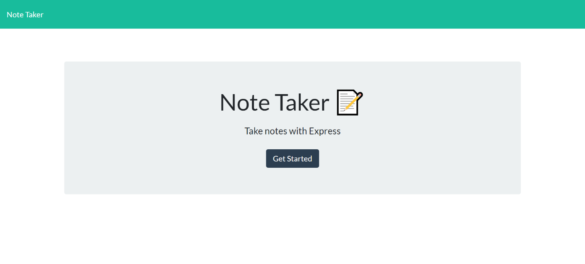
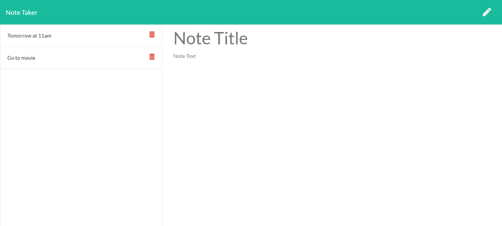

# Note-Taker

## Table of Contents

* [Introduction](#Introduction)
* [Installation](#Installation)
* [License](#License)
* [Screenshot](#Screenshot)
* [Link](#Link)

## Introduction

* The project is about creating application that can be used to write, save, and delete notes. This application will use an express backend and save and retrieve note data from a JSON file. 

* For users that need to keep track of a lot of information, it's easy to forget or be unable to recall something important. Being able to take persistent notes allows users to have written information available when needed.
## Installation

* node js 
* Visual Studio Code 1.51.1

## License

## Screenshot

## Link

* Link: https://app-note-taker-for-u.herokuapp.com/

